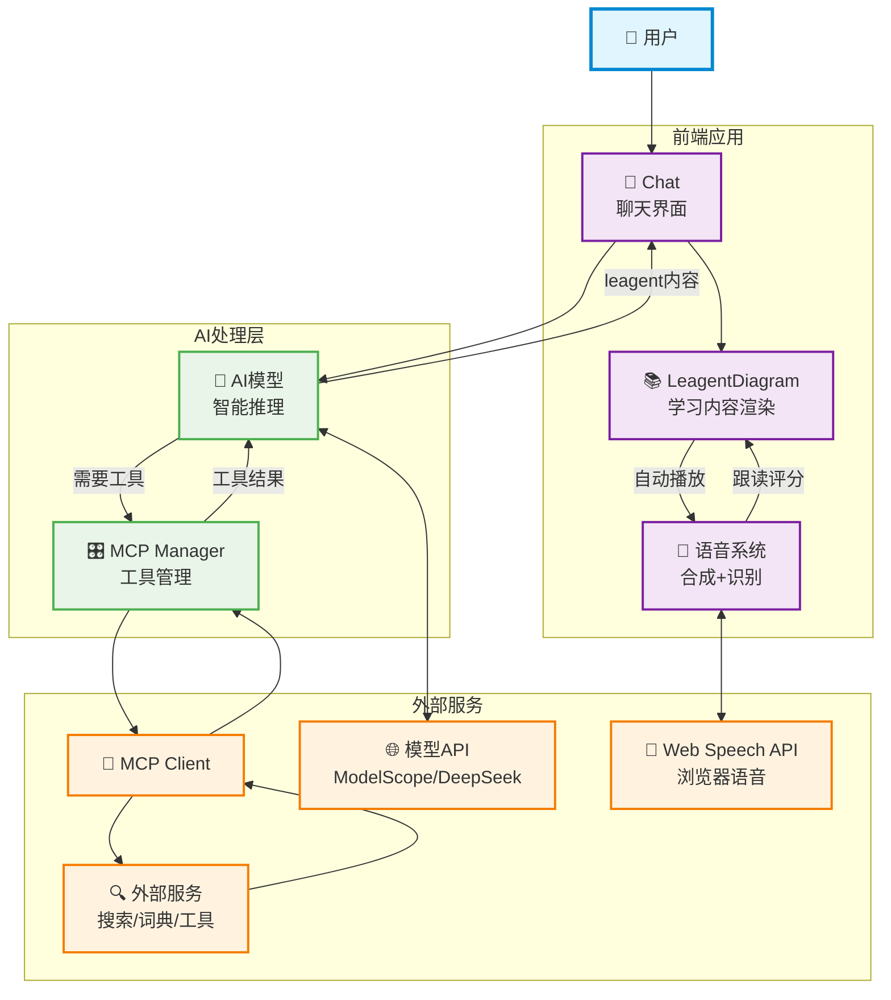
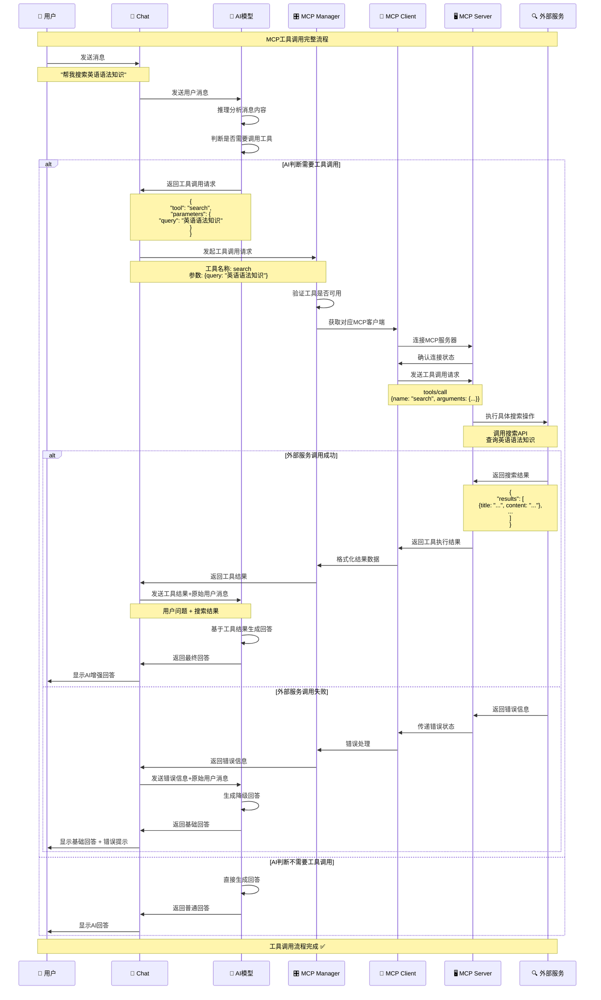
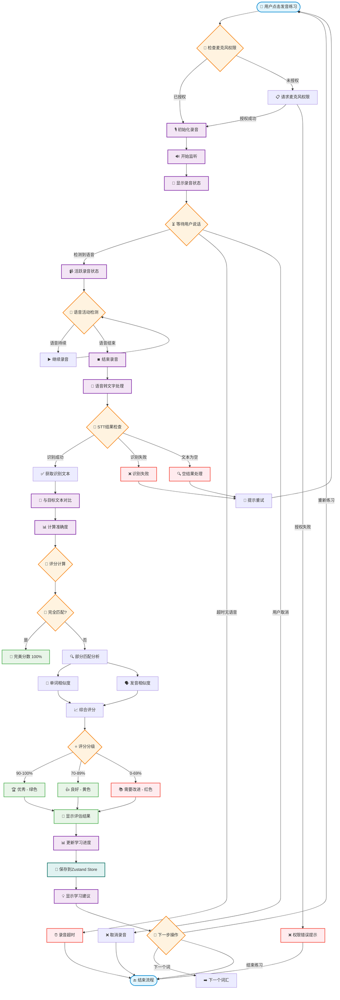
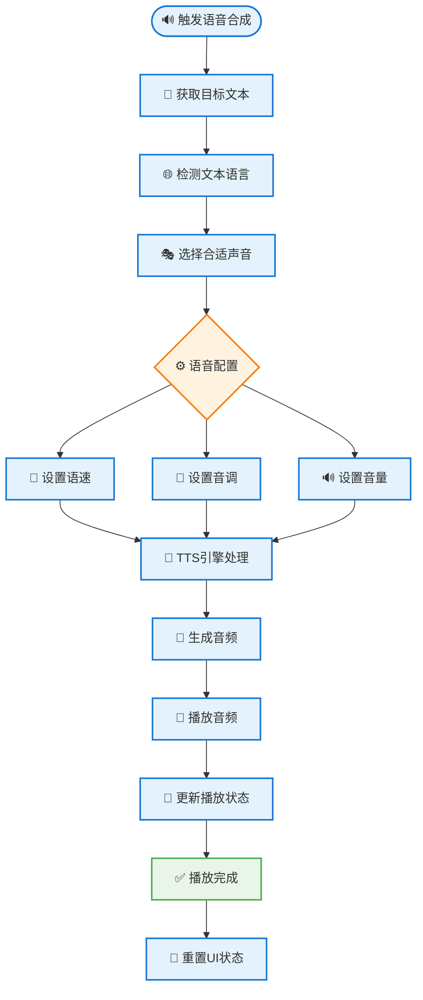
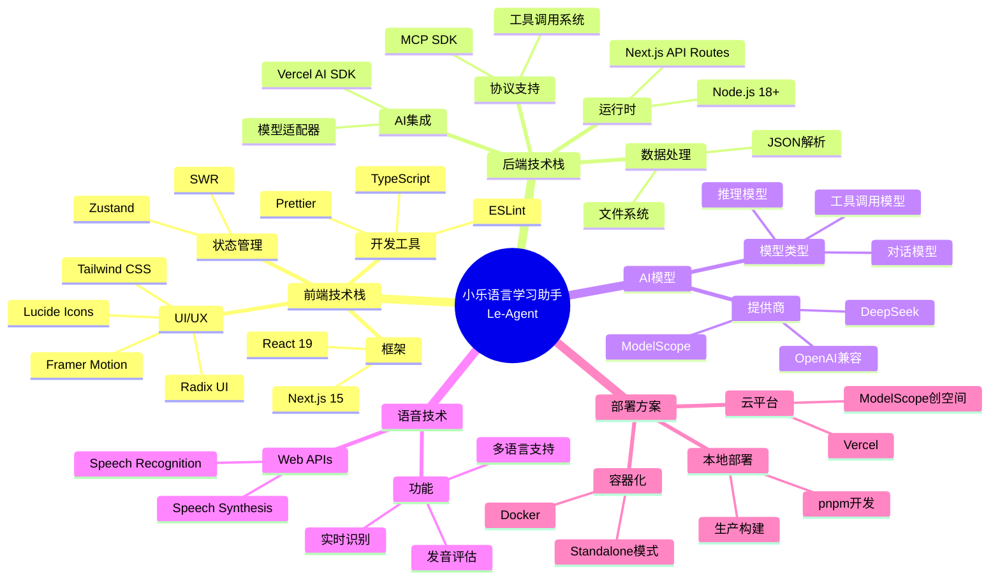

# 小乐语言学习助手 (Le-Agent) - 系统架构图

## 简化系统架构



## 学习模式数据流

````mermaid
sequenceDiagram
    participant U as 👤 用户
    participant CB as 📱 ChatBox
    participant AI as 🤖 AI模型
    participant LD as 📚 LeagentDiagram
    participant LP as 🎯 LeagentPopup
    participant SS as 🔊 语音合成
    participant SR as 🎙️ 语音识别
    participant ZS as 🗃️ Zustand Store

    U->>CB: 输入学习请求
    CB->>AI: 发送聊天消息
    AI->>CB: 返回结构化学习内容
    Note over AI,CB: ```leagent<br/>{学习内容JSON}
    CB->>LD: 渲染学习内容
    LD->>LD: 解析词汇和句子
    LD->>ZS: 保存学习数据
    LD->>LP: 自动打开学习模式

    U->>LD: 悬停词汇
    LD->>SS: 自动朗读词汇
    SS->>U: 播放语音

    U->>LP: 点击发音练习
    LP->>SR: 启动语音识别
    SR->>LP: 返回识别结果
    LP->>LP: 评估发音准确度
    LP->>ZS: 更新学习进度
    LP->>U: 显示发音评分
````

## 完整项目流程时序图

````mermaid
sequenceDiagram
    participant U as 👤 用户
    participant Chat as 💬 Chat
    participant AI as 🤖 AI模型
    participant MM as 🎛️ MCP Manager
    participant MC as 🔌 MCP Client
    participant ES as 🔍 外部服务
    participant LD as 📚 LeagentDiagram
    participant Speech as 🎤 语音系统

    Note over U,Speech: 完整学习流程 - 从输入到评估

    %% Phase 1: 用户输入和AI推理
    U->>Chat: 输入学习请求
    Note over U,Chat: "请帮我学习英语时态"

    Chat->>AI: 发送用户请求
    AI->>AI: 推理分析用户需求
    AI->>AI: 判断是否需要工具调用

    alt 需要工具增强
        AI->>Chat: 返回工具调用请求
        Note over AI,Chat: {tool: "search", params: {query: "英语时态"}}

        %% Phase 2: MCP工具调用
        Chat->>MM: 发起工具调用
        MM->>MC: 获取对应客户端
        MC->>ES: 执行外部搜索
        ES->>MC: 返回搜索结果
        MC->>MM: 格式化结果
        MM->>Chat: 返回工具结果

        %% 再次AI处理
        Chat->>AI: 发送工具结果 + 原始请求
        AI->>AI: 基于工具结果生成学习内容
    else 直接生成内容
        AI->>AI: 直接生成学习内容
    end

    %% Phase 3: 内容生成和学习模式
    AI->>Chat: 返回leagent格式内容
    Note over AI,Chat: ```leagent<br/>{vocab, sentences, translation}

    Chat->>LD: 渲染学习内容
    LD->>LD: 解析学习内容
    LD->>U: 显示学习内容

    %% Phase 4: 语音学习流程
    LD->>Speech: 自动开始语音合成
    Speech->>U: 播放学习内容发音

    Speech->>Speech: 启动语音识别
    Speech->>U: 提示"请跟读"
    U->>Speech: 跟读发音

    Speech->>Speech: 处理语音识别和评分
    Speech->>U: 显示评分结果

    %% Phase 5: 学习完成
    Speech->>Chat: 学习模式结束
    Chat->>U: 返回聊天状态

    Note over U,Speech: 学习循环继续 🔄
````

## MCP工具调用流程



## 语音学习功能架构

### 完整语音识别与评估流程



### 语音合成(TTS)流程



## 完整学习流程数据流

```mermaid
flowchart TD
    %% 用户输入阶段
    Start([👤 用户开始学习]) --> InputType{📝 输入类型检测}

    %% 输入分支
    InputType -->|普通学习请求| NormalChat[💬 普通对话模式]
    InputType -->|@mention工具| ToolCall[🔧 工具调用模式]

    %% 工具调用分支
    ToolCall --> MCPManager[🎛️ MCP管理器]
    MCPManager --> ToolExecution[⚡ 执行外部工具]
    ToolExecution --> ToolResult[📋 获取工具结果]
    ToolResult --> AIEnhanced[🤖 AI增强处理]

    %% 普通对话分支
    NormalChat --> AIProcess[🤖 AI模型处理]
    AIEnhanced --> AIProcess

    %% AI处理阶段
    AIProcess --> ContentCheck{📊 内容类型检查}
    ContentCheck -->|学习内容| LeagentFormat[📚 Leagent格式生成]
    ContentCheck -->|普通回复| NormalReply[💭 普通消息显示]

    %% 学习内容处理
    LeagentFormat --> ParseContent[🔍 解析学习内容]
    ParseContent --> ExtractVocab[📝 提取词汇]
    ParseContent --> ExtractSentences[📖 提取句子]
    ParseContent --> ExtractTranslation[🌐 提取翻译]

    %% 内容渲染
    ExtractVocab --> RenderDiagram[🎨 渲染学习图表]
    ExtractSentences --> RenderDiagram
    ExtractTranslation --> RenderDiagram

    %% 用户交互
    RenderDiagram --> UserInteraction{👆 用户交互类型}
    UserInteraction -->|悬停词汇| AutoTTS[🔊 自动朗读]
    UserInteraction -->|点击练习| OpenLearningMode[🎯 打开学习模式]
    UserInteraction -->|浏览内容| ContentBrowsing[👀 内容浏览]

    %% 自动朗读流程
    AutoTTS --> TTSProcess[🎵 语音合成处理]
    TTSProcess --> PlayVoice[📢 播放语音]
    PlayVoice --> BackToInteraction[↩️ 返回交互]
    BackToInteraction --> UserInteraction

    %% 学习模式流程
    OpenLearningMode --> LearningModeType{🎓 学习模式选择}
    LearningModeType -->|词汇练习| VocabPractice[📝 词汇发音练习]
    LearningModeType -->|句子练习| SentencePractice[📖 句子跟读练习]

    %% 语音识别流程 (词汇)
    VocabPractice --> StartVocabRecording[🎙️ 开始词汇录音]
    StartVocabRecording --> VocabSTT[🔄 词汇语音转文字]
    VocabSTT --> VocabAccuracy[📊 词汇准确度评估]
    VocabAccuracy --> VocabScore[⭐ 词汇评分显示]

    %% 语音识别流程 (句子)
    SentencePractice --> StartSentenceRecording[🎙️ 开始句子录音]
    StartSentenceRecording --> SentenceSTT[🔄 句子语音转文字]
    SentenceSTT --> SentenceAccuracy[📊 句子准确度评估]
    SentenceAccuracy --> SentenceScore[⭐ 句子评分显示]

    %% 评分处理
    VocabScore --> ScoreAnalysis[🧮 综合评分分析]
    SentenceScore --> ScoreAnalysis

    %% 学习数据更新
    ScoreAnalysis --> UpdateProgress[📈 更新学习进度]
    UpdateProgress --> SaveLearningData[💾 保存学习数据]
    SaveLearningData --> GenerateSuggestions[💡 生成学习建议]

    %% 学习建议展示
    GenerateSuggestions --> ShowResults[📱 显示学习结果]
    ShowResults --> NextStepChoice{🔄 下一步选择}

    %% 循环学习
    NextStepChoice -->|继续练习| UserInteraction
    NextStepChoice -->|新的学习请求| Start
    NextStepChoice -->|结束学习| EndSession[🏁 结束学习会话]

    %% 普通回复流程
    NormalReply --> SaveChatHistory[💬 保存对话历史]
    SaveChatHistory --> DisplayMessage[📺 显示消息]
    DisplayMessage --> WaitForInput[⏳ 等待新输入]
    WaitForInput --> Start

    %% 内容浏览流程
    ContentBrowsing --> SaveViewData[👁️ 保存浏览数据]
    SaveViewData --> BackToInteraction

    %% 样式定义
    classDef userAction fill:#e1f5fe,stroke:#0288d1,stroke-width:2px
    classDef aiProcess fill:#f3e5f5,stroke:#7b1fa2,stroke-width:2px
    classDef mcpProcess fill:#fff3e0,stroke:#f57c00,stroke-width:2px
    classDef speechProcess fill:#ffebee,stroke:#f44336,stroke-width:2px
    classDef dataProcess fill:#e0f2f1,stroke:#00695c,stroke-width:2px
    classDef result fill:#e8f5e8,stroke:#4caf50,stroke-width:2px

    class Start,InputType,UserInteraction,LearningModeType,NextStepChoice userAction
    class AIProcess,ContentCheck,LeagentFormat,ParseContent,AIEnhanced aiProcess
    class ToolCall,MCPManager,ToolExecution,ToolResult mcpProcess
    class StartVocabRecording,VocabSTT,VocabAccuracy,StartSentenceRecording,SentenceSTT,SentenceAccuracy,AutoTTS,TTSProcess speechProcess
    class RenderDiagram,UpdateProgress,SaveLearningData,SaveChatHistory,SaveViewData dataProcess
    class VocabScore,SentenceScore,ScoreAnalysis,GenerateSuggestions,ShowResults,EndSession result
```

## 技术栈组件图



## 系统架构说明

### 1. 前端应用层

- **Next.js 15**：现代React框架，支持SSR和API Routes
- **组件化设计**：模块化的React组件，便于维护和扩展
- **响应式UI**：基于Tailwind CSS和Radix UI的现代界面
- **状态管理**：Zustand提供轻量级全局状态管理

### 2. AI集成层

- **Vercel AI SDK**：统一的AI模型接口，支持流式输出
- **多模型支持**：集成ModelScope、DeepSeek等多个模型提供商
- **MCP协议**：Model Context Protocol支持工具扩展

### 3. 语音处理系统

- **双向语音交互**：语音合成(TTS)和语音识别(STT)
- **多语言支持**：支持50+种语言和方言
- **发音评估**：智能发音准确度评分系统

### 4. 学习功能模块

- **智能内容生成**：结构化的语言学习材料
- **互动学习模式**：词汇练习、句子跟读、发音评估
- **进度追踪**：学习历史和个性化建议

### 5. 工具扩展系统

- **MCP协议支持**：标准化的工具集成接口
- **外部服务集成**：搜索、翻译、词典等工具
- **灵活配置**：通过配置文件管理工具服务

这个架构设计确保了系统的可扩展性、维护性和用户体验的优化。
